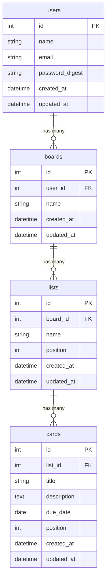

# TaskManagement

Trello風のタスク管理アプリです。ボード・リスト・カードの3階層でタスクを視覚的に管理できます。

## 📌 アプリ概要

個人のタスク管理において、進捗状況が一目でわからない・タスクが散在するという課題を解決するために作成しました。
ドラッグ&ドロップでカードを移動でき、直感的な操作でタスクを管理できます。

## 🛠 使用技術

| 役割 | 技術 |
|---|---|
| バックエンド | Java / Spring Boot |
| フロントエンド | React |
| 認証 | Spring Security |
| ドラッグ&ドロップ | react-beautiful-dnd |
| データベース | PostgreSQL |
| ORM | JPA / Hibernate |
| APIクライアント | Axios |
| ビルドツール | Maven |

## ✅ 機能一覧

- ユーザー登録・ログイン・ログアウト
- ゲストログイン（ワンクリックでデモアカウントにログイン）
- ボードの作成・編集・削除
- リストの作成・編集・削除
- カードの作成・編集・削除（タイトル・説明・期限日）
- ドラッグ&ドロップでカードをリスト間に移動

## 🗂 ER図

## 🔑 デモアカウント

| 項目 | 内容 |
|---|---|
| メールアドレス | demo@example.com |
| パスワード | password |

## 🚀 環境構築手順

※ Spring Boot アプリ完成後に追記予定
