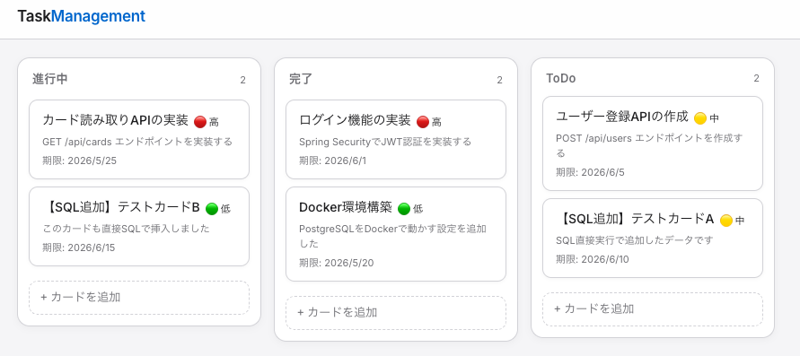
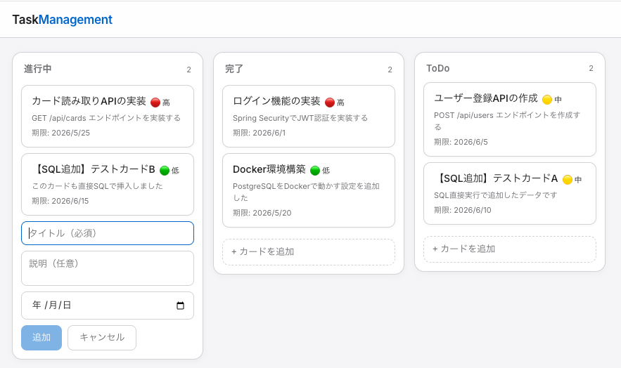
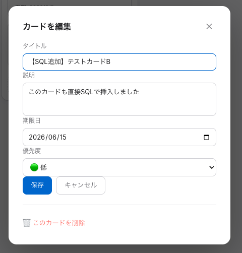
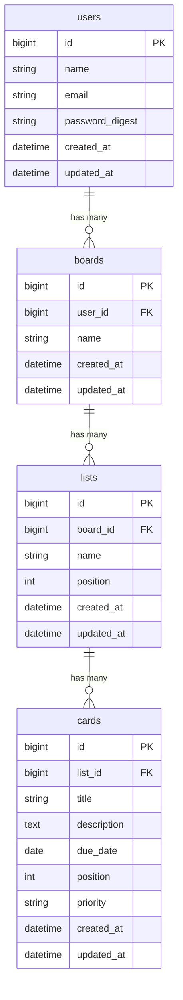

# TaskManagement

Trello風のカンバンボード型タスク管理アプリです。Java（Spring Boot）+ React で構築したフルスタックWebアプリケーションです。

---

## アプリ概要

「タスクが散在していて進捗が把握できない」という個人の課題を解決するために開発しました。

ボード・リスト・カードの3階層でタスクを視覚的に整理でき、ドラッグ&ドロップによる直感的な操作でカードをリスト間に移動できます。優先度バッジ（🔴高 / 🟡中 / 🟢低）によってタスクの緊急度を一目で把握できます。

---

## 画面構成

### ① ボード画面（メイン）



カードがリスト（進行中 / 完了 / ToDo）ごとに表示される。優先度バッジ（🔴高 / 🟡中 / 🟢低）が各カードに表示され、ドラッグ&ドロップでリスト間を移動できる。

---

### ② カード追加フォーム



各リスト下部の「+ カードを追加」をクリックすると入力フォームが展開する。タイトル（必須）・説明・期限日を入力して「追加」で保存。

---

### ③ カード編集モーダル



カードをクリックするとモーダルが開く。タイトル・説明・期限日・優先度を編集して「保存」。モーダル下部の「🗑 このカードを削除」から2段階確認を経て削除できる。

---

## 実装済み機能

| 機能 | 説明 |
|------|------|
| カード作成 | タイトル・説明・期限日・優先度を入力してカードを追加 |
| カード編集 | クリックでモーダルを開き各項目を編集・保存 |
| カード削除 | 2段階確認を経て物理削除 |
| 優先度表示 | 🔴高 / 🟡中 / 🟢低 のバッジをカードに表示 |
| ドラッグ&ドロップ | カードをリスト間・リスト内で自由に並び替え |
| 並び順の永続化 | ドロップ後にAPIで position を保存し、リロードしても順番を維持 |

## 今後実装予定の機能

| 機能 |
|------|
| ユーザー登録・ログイン・ログアウト（JWT認証） |
| ゲストログイン（デモアカウントへのワンクリックログイン） |
| ボードの作成・編集・削除 |
| リストの作成・編集・削除 |
| 優先度順・期限順でのカード並び替えボタン |

---

## 技術スタック

### バックエンド

| 役割 | 技術 | バージョン | 選定理由 |
|------|------|----------|---------|
| 言語 | Java | 21.0.11 | 静的型付けによる安全性・エンタープライズ標準 |
| フレームワーク | Spring Boot | 4.0.6 | 設定より規約・DIコンテナ・豊富なエコシステム |
| 認証 | Spring Security | 7.0.5 | Spring との統合が容易・認証認可の標準実装 |
| ORM | JPA / Hibernate | 7.2.12 | SQLを意識せずエンティティでDB操作が可能 |
| ビルドツール | Maven | 3.x（mvnw） | 依存関係管理と再現性のあるビルド |

### フロントエンド

| 役割 | 技術 | バージョン | 選定理由 |
|------|------|----------|---------|
| フレームワーク | React | 19.2.6 | コンポーネント指向・業界標準・豊富な周辺ライブラリ |
| ビルドツール | Vite | 8.0.14 | 高速な開発サーバーとHMR |
| APIクライアント | Axios | 1.16.1 | インターセプター・エラーハンドリングが容易 |
| D&D | @dnd-kit/core + sortable | 6.x / 10.x | アクセシビリティ対応・軽量・react-beautiful-dnd より活発にメンテナンスされている |

### インフラ

| 役割 | 技術 | バージョン |
|------|------|----------|
| データベース | PostgreSQL | 16 |
| コンテナ | Docker / Docker Compose | - |
| ランタイム | Node.js | 22.22.3 |

---

## 品質管理への取り組み

### フロントエンド

- **ESLint** による静的解析（`npm run lint` で違反ゼロを確認）
- React Hooks のルール準拠（`react-hooks/exhaustive-deps` 対応）
- `useCallback` によるパフォーマンス最適化

### バックエンド

- **Checkstyle** による静的解析（`mvn validate` でビルド時に自動チェック）
  - ワイルドカードimport禁止・タブ文字禁止・未使用import禁止
- **`@Transactional`** による DB操作の整合性保証（読み取りは `readOnly = true`）
- **Bean Validation**（`@NotBlank` / `@NotNull` / `@Size` / `@Pattern`）でリクエストを検証
- **`@RestControllerAdvice`** でエラーレスポンスを統一（400 / 404 を JSON で返却）

---

## API一覧

### 実装済み

| メソッド | エンドポイント | 説明 |
|---------|--------------|------|
| GET | `/api/cards` | カード一覧取得 |
| GET | `/api/cards/{id}` | カード1件取得 |
| POST | `/api/cards` | カード作成 |
| PUT | `/api/cards/{id}` | カード更新（タイトル・説明・期限日・優先度・並び順・リスト移動） |
| DELETE | `/api/cards/{id}` | カード削除 |

### 今後実装予定

| メソッド | エンドポイント | 説明 |
|---------|--------------|------|
| POST | `/api/auth/register` | ユーザー登録 |
| POST | `/api/auth/login` | ログイン |
| GET / POST | `/api/boards` | ボード一覧取得 / 作成 |
| PUT / DELETE | `/api/boards/{id}` | ボード更新 / 削除 |
| GET / POST | `/api/lists` | リスト一覧取得 / 作成 |
| PUT / DELETE | `/api/lists/{id}` | リスト更新 / 削除 |

---

## ER図



---

## 環境構築手順

### 前提条件

- Docker / Docker Compose がインストール済みであること
- Node.js 22.12以上 がインストール済みであること
- Java 21 がインストール済みであること

### 1. リポジトリをクローン

```bash
git clone https://github.com/KAT-brave/TaskManagement.git
cd TaskManagement
```

### 2. データベースを起動（Docker）

```bash
docker compose up -d
```

| 設定項目 | 値 |
|---------|---|
| ホスト | localhost:5432 |
| DB名 | taskmanagement |
| ユーザー | postgres |
| パスワード | password（開発環境用） |

### 3. バックエンドを起動

```bash
cd backend
./mvnw spring-boot:run
# → http://localhost:8080 で起動
```

### 4. フロントエンドを起動

```bash
cd frontend
npm install
npm run dev
# → http://localhost:5173 で起動
```

---

## ドキュメント

| ドキュメント | 内容 |
|------------|------|
| [機能要件](docs/functional_requirements.md) | 機能一覧・URL設計・ユースケース |
| [技術スタック](docs/tech_stack.md) | 使用技術とバージョン一覧 |
| [DB設計](docs/database_design.md) | テーブル定義・ER図 |
| [画面設計](docs/screen_design.md) | 画面一覧・UIデザイン仕様 |
| [要件定義](docs/requirements.md) | アプリの目的・ターゲット・要件 |
