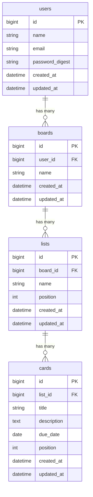

# TaskManagement

Trello風のタスク管理アプリです。ボード・リスト・カードの3階層でタスクを視覚的に管理できます。

## アプリ概要

個人のタスク管理において、進捗状況が一目でわからない・タスクが散在するという課題を解決するために作成しました。
ドラッグ&ドロップでカードを移動でき、直感的な操作でタスクを管理できます。

---

## 技術スタック

### バックエンド

| 役割 | 技術 | バージョン |
|------|------|----------|
| 言語 | Java | 21.0.11 |
| フレームワーク | Spring Boot | 4.0.6 |
| 認証 | Spring Security | 7.0.5 |
| ORM | JPA / Hibernate | 7.2.12 |
| ビルドツール | Maven | 3.x（mvnw） |

### フロントエンド

| 役割 | 技術 | バージョン |
|------|------|----------|
| フレームワーク | React | 19.2.6 |
| ビルドツール | Vite | 8.0.14 |
| APIクライアント | Axios | 1.16.1 |

### インフラ

| 役割 | 技術 | バージョン |
|------|------|----------|
| データベース | PostgreSQL | 16 |
| コンテナ | Docker / Docker Compose | - |
| ランタイム | Node.js | 22.22.3 |

---

## 機能一覧

- ユーザー登録・ログイン・ログアウト
- ゲストログイン（ワンクリックでデモアカウントにログイン）
- ボードの作成・編集・削除
- リストの作成・編集・削除
- カードの作成・編集・削除（タイトル・説明・期限日）
- ドラッグ&ドロップでカードをリスト間に移動
- 優先度順・期限順でのカード並び替え

---

## API一覧

### 現在実装済み

| メソッド | エンドポイント | 説明 |
|---------|--------------|------|
| GET | `/api/cards` | カード一覧取得 |
| GET | `/api/cards/{id}` | カード1件取得 |

### 今後実装予定

| メソッド | エンドポイント | 説明 |
|---------|--------------|------|
| POST | `/api/cards` | カード作成 |
| PUT | `/api/cards/{id}` | カード更新 |
| DELETE | `/api/cards/{id}` | カード削除 |
| GET | `/api/boards` | ボード一覧取得 |
| POST | `/api/boards` | ボード作成 |
| GET | `/api/lists` | リスト一覧取得 |
| POST | `/api/lists` | リスト作成 |
| POST | `/api/auth/register` | ユーザー登録 |
| POST | `/api/auth/login` | ログイン |

---

## ER図



---

## 環境構築手順

### 前提条件

- Docker / Docker Compose がインストール済みであること
- Node.js 22.12以上 がインストール済みであること
- Java 21 がインストール済みであること

### 1. リポジトリをクローン

```bash
git clone https://github.com/KAT-brave/TaskManagement.git
cd TaskManagement
```

### 2. データベースを起動（Docker）

```bash
docker compose up -d
```

| 設定項目 | 値 |
|---------|---|
| ホスト | localhost:5432 |
| DB名 | taskmanagement |
| ユーザー | postgres |
| パスワード | password |

### 3. バックエンドを起動

```bash
cd backend
./mvnw spring-boot:run
# → http://localhost:8080 で起動
```

### 4. フロントエンドを起動

```bash
cd frontend
npm install
npm run dev
# → http://localhost:5173 で起動
```

---

## ドキュメント

| ドキュメント | 内容 |
|------------|------|
| [機能要件](docs/functional_requirements.md) | 機能一覧・URL設計・ユースケース |
| [技術スタック](docs/tech_stack.md) | 使用技術とバージョン一覧 |
| [DB設計](docs/database_design.md) | テーブル定義・ER図 |
| [画面設計](docs/screen_design.md) | 画面一覧・UIデザイン仕様 |
| [要件定義](docs/requirements.md) | アプリの目的・ターゲット・要件 |
