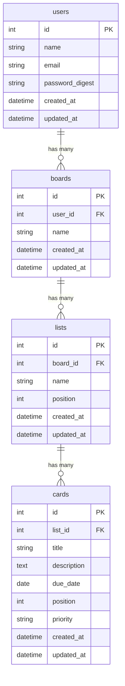

# データベース設計

## テーブルの関係

```
User（1） → Board（多）
Board（1） → List（多）
List（1） → Card（多）
```

## ER図



## テーブル定義

### users テーブル（ユーザー）

| カラム名 | 型 | 説明 |
|---|---|---|
| id | integer | 主キー |
| name | string | ユーザー名 |
| email | string | メールアドレス |
| password_digest | string | パスワード（暗号化） |
| created_at | datetime | 作成日時 |
| updated_at | datetime | 更新日時 |

### boards テーブル（ボード）

| カラム名 | 型 | 説明 |
|---|---|---|
| id | integer | 主キー |
| user_id | integer | 作成したユーザーのID |
| name | string | ボード名 |
| created_at | datetime | 作成日時 |
| updated_at | datetime | 更新日時 |

### lists テーブル（リスト）

| カラム名 | 型 | 説明 |
|---|---|---|
| id | integer | 主キー |
| board_id | integer | 所属するボードのID |
| name | string | リスト名 |
| position | integer | 表示順 |
| created_at | datetime | 作成日時 |
| updated_at | datetime | 更新日時 |

### cards テーブル（カード）

| カラム名 | 型 | 説明 |
|---|---|---|
| id | integer | 主キー |
| list_id | integer | 所属するリストのID |
| title | string | カードタイトル |
| description | text | カードの説明 |
| due_date | date | 期限日 |
| position | integer | リスト内の表示順 |
| priority | varchar(10) | 優先度（high / medium / low） |
| created_at | datetime | 作成日時 |
| updated_at | datetime | 更新日時 |
