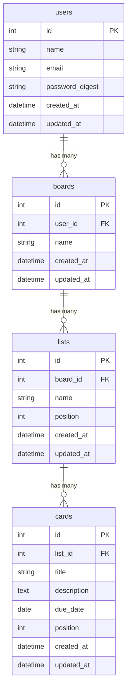

# ER図

```mermaid
erDiagram
    users {
        int id PK
        string name
        string email
        string password_digest
        datetime created_at
        datetime updated_at
    }

    boards {
        int id PK
        int user_id FK
        string name
        datetime created_at
        datetime updated_at
    }

    lists {
        int id PK
        int board_id FK
        string name
        int position
        datetime created_at
        datetime updated_at
    }

    cards {
        int id PK
        int list_id FK
        string title
        text description
        date due_date
        int position
        datetime created_at
        datetime updated_at
    }

    users ||--o{ boards : "has many"
    boards ||--o{ lists : "has many"
    lists ||--o{ cards : "has many"
```

## 記号の意味

| 記号 | 意味 |
|---|---|
| `PK` | 主キー（テーブルの識別番号） |
| `FK` | 外部キー（他のテーブルとの紐付け） |
| `\|\|--o{` | 1対多の関係 |
